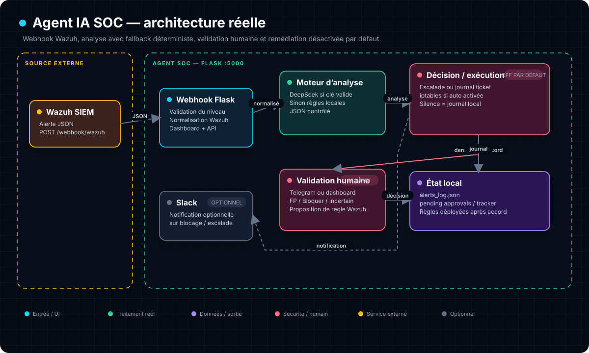

# 🤖 Agent IA SOC — Automatisation Wazuh × Telegram × IA

```
 █████╗  ██████╗ ███████╗███╗   ██╗████████╗    ██╗ █████╗     ███████╗ ██████╗  ██████╗
██╔══██╗██╔════╝ ██╔════╝████╗  ██║╚══██╔══╝    ██║██╔══██╗    ██╔════╝██╔═══██╗██╔════╝
███████║██║  ███╗█████╗  ██╔██╗ ██║   ██║       ██║███████║    ███████╗██║   ██║██║
██╔══██║██║   ██║██╔══╝  ██║╚██╗██║   ██║       ██║██╔══██║    ╚════██║██║   ██║██║
██║  ██║╚██████╔╝███████╗██║ ╚████║   ██║       ██║██║  ██║    ███████║╚██████╔╝╚██████╗
╚═╝  ╚═╝ ╚═════╝ ╚════════╝╚═╝  ╚═══╝   ╚═╝       ╚═╝╚═╝  ╚═╝    ╚══════╝ ╚═════╝  ╚═════╝
```

> **Un agent SOC défensif. Il reçoit les alertes Wazuh, les analyse (LLM ou heuristique), journalise ou exécute l’action autorisée par la configuration, puis sollicite une décision humaine sur Telegram ou dans le dashboard. La remédiation automatique est désactivée par défaut.**

## ⚠️ Ce qui est implémenté vs ce qui est un prototype

Pour rester honnête sur le niveau de maturité du dépôt, les fonctionnalités sont classées en deux catégories :

**✅ Effectives (code fonctionnel et testé)**
- Webhook `/webhook/wazuh` + dashboard web (stats, journal, historique et décisions).
- Analyse d'alerte via **DeepSeek API**, avec repli automatique sur un moteur **heuristique** hors-ligne.
- Décision humaine sur **Telegram** (APPROUVER / REJETER / INCERTAIN) + endpoints équivalents sur le dashboard, notamment pour les propositions de règles Wazuh.
- Blocage IP via **iptables** (`block_ip`, `block_ip_temporary` avec déblocage planifié à 1 h).
- Notification **Slack** si un webhook est fourni.
- Détection des **faux positifs** et génération de règles de silence Wazuh.
- Journal des actions dans `alerts_log.json`, approbations en attente dans `pending_approvals.json`.

**🔬 Prototypes / à connecter (structure prévue, pas encore câblée)**
- **Désactivation d'un compte Active Directory** : la commande `net user … /active:no` est définie dans `config.py` mais n'est **pas exécutée** par le moteur de remédiation.
- **Création d'un vrai ticket GLPI** : le code loggue « Ticket à créer » mais **n'appelle pas l'API GLPI** ; il faut brancher `GLPI_URL` / `GLPI_API_TOKEN`.

> La remédiation automatique est **désactivée par défaut** (variable `SOC_ENABLE_AUTO_REMEDIATION`). Sans cette variable à `true`, le moteur enregistre l'action mais ne l'exécute pas.

[](https://python.org)
[](https://flask.palletsprojects.com/)
[](https://wazuh.com)
[](https://core.telegram.org/bots)
[](tests/)
[](LICENSE)

---

## 🎯 Le problème

Les analystes SOC N1 doivent régulièrement :
- Trier des **faux positifs** et des événements légitimes
- **Copier-coller** des IP dans des outils de blocage
- Documenter puis faire valider les décisions sensibles

Ces tâches répétitives ralentissent le traitement et détournent l’attention des incidents prioritaires.

## 💡 La solution

**Agent IA SOC** aide à fermer la boucle — de la détection à la décision — en réduisant le temps passé à trier le bruit. Le webhook normalise l’alerte, le moteur l’analyse, puis journalise ou exécute l’action selon la configuration. Telegram et le dashboard fournissent ensuite une validation humaine pour les propositions de règles et les décisions sensibles.

---

## 🏗️ Architecture



Le moteur tente DeepSeek lorsqu’une clé est disponible, puis bascule sur des règles locales. La remédiation automatique reste **désactivée par défaut** : sans `SOC_ENABLE_AUTO_REMEDIATION=true`, aucun blocage IP proposé par l’analyse n’est exécuté. Les intégrations AD et GLPI restent hors du flux effectif.

---

## ⚡ Quick Start

```bash
# 1. Cloner
git clone https://github.com/Yukouf/agent-ia-soc.git && cd agent-ia-soc

# 2. Dépendances
pip install flask requests

# 3. Configurer Telegram
export TELEGRAM_BOT_TOKEN="votre_token"
export TELEGRAM_CHAT_IDS='["ID_CHAT_1","ID_CHAT_2"]'

# 4. Lancer
python3 webhook_receiver.py
```

```
╔══════════════════════════════════════════╗
║   🤖 Agent IA SOC — Automatique          ║
║                                          ║
║   Dashboard: http://0.0.0.0:5000         ║
║   Webhook:   POST /webhook/wazuh         ║
║   Test:      GET  /webhook/test          ║
╚══════════════════════════════════════════╝
```

---

## 🧠 Comment ça marche

### 1. Alerte Wazuh → Webhook

Wazuh envoie ses alertes au webhook `/webhook/wazuh` :

```json
{
  "rule": {
    "id": "100002",
    "level": 10,
    "description": "Bruteforce SSH detected from 192.168.1.100"
  },
  "data": {
    "srcip": "192.168.1.100",
    "srcuser": "root"
  }
}
```

### 2. Analyse par IA

L'`ai_engine.py` analyse l'alerte et retourne :

```json
{
  "severity": "high",
  "confidence": 92,
  "explanation": "15 tentatives SSH en 30 secondes depuis une IP externe inconnue. Aucune raison légitime.",
  "suggested_action": "block_ip",
  "is_false_positive": false
}
```

### 3. Validation humaine sur Telegram

> ⚠️ **ALERTE #100002 — BRUTEFORCE SSH**
> IP: `192.168.1.100` | Agent: `srv-web-01`
> **Action suggérée :** `block_ip`
>
> [✅ APPROUVE] [❌ REJETTE] [❓ INCERTAIN]

### 4. Remédiation

Si approuvé **et** si la remédiation automatique est activée (`SOC_ENABLE_AUTO_REMEDIATION=true`), le `remediation_engine.py` exécute :

| Action | État | Comportement |
|---|---|---|
| `block_ip` | ✅ effectif | `iptables -A INPUT -s IP -j DROP` |
| `block_ip_temporary` | ✅ effectif | Blocage 1 h puis suppression auto |
| `silence_alert` | ✅ effectif | Enregistre le faux positif + règle de silence Wazuh |
| `notify_slack` | ✅ effectif | Alerte Slack (si webhook fourni) |
| `verify_and_escalate` | ✅ effectif | Escalade vers l'humain (log + Slack) |
| `create_ticket` | ⚠️ partiel | Loggue « Ticket à créer » — l'appel API GLPI reste à brancher |
| `disable_user_ad` | 🔬 prototype | Défini dans `config.py`, **non exécuté** par le moteur |

> **Important :** si la remédiation automatique est désactivée (réglage par défaut), ces actions sont **enregistrées dans le journal** mais **jamais exécutées** — la validation humaine reste obligatoire.

---

## 📊 Dashboard web

Interface minimale rendue côté serveur, avec un JavaScript client limité à l’auto-rafraîchissement et aux actions d’approbation :

- 🔴 **Alertes actives** avec sévérité et confiance
- 📋 **Historique** des remédiations
- 📈 **Statistiques** (faux positifs, actions exécutées)
- 🔍 **Détail** par alerte

---

## 🧪 Tests

```bash
python3 -m unittest discover -s tests -v
```

```
test_auto_remediation_is_disabled_by_default ... ok
test_xss_telegram_approve ...................... ok
test_xss_telegram_reject ....................... ok
test_xss_telegram_unsure ....................... ok
test_xss_dashboard_approve ..................... ok
test_xss_dashboard_reject ...................... ok
test_xss_dashboard_unsure ...................... ok
test_xss_payload_escape ........................ ok
test_fp_tracker_integrity ...................... ok
test_pending_approvals_integrity ............... ok
test_security_headers .......................... ok

Ran 11 tests in 0.024s — OK
```

---

## 🔒 Sécurité

- ✅ Échappement HTML de toutes les données non fiables (XSS)
- ✅ JavaScript client limité au rafraîchissement et aux décisions du dashboard
- ✅ Validation des payloads entrants
- ✅ Tests de sécurité automatisés
- ✅ Détection des faux positifs, proposition de règles et déploiement après accord

---

## 📁 Structure

```
agent-ia-soc/
├── webhook_receiver.py    # Serveur Flask + dashboard + endpoints
├── ai_engine.py            # Analyse IA des alertes
├── remediation_engine.py   # Exécution des actions
├── telegram_bot.py         # Bot Telegram (polling + notifications)
├── wazuh_rule_manager.py   # Gestion des règles de silence Wazuh
├── sample_alerts.py        # Jeu d'alertes de test
├── config.py               # Configuration centralisée
├── test_fp.py              # Test des faux positifs
├── tests/
│   └── test_security.py    # 11 tests de sécurité
├── assets/architecture.svg # Schéma d’architecture vectoriel
├── alerts_log.json         # Log des alertes traitées (généré à l'exécution)
├── fp_tracker.json         # Tracker de faux positifs (généré à l'exécution)
└── pending_approvals.json  # Approbations en attente (généré à l'exécution)
```

---

## 🛣️ Roadmap

- [ ] Intégration native Discord (en plus de Telegram)
- [x] Détection automatique des faux positifs
- [x] Dashboard léger avec rafraîchissement et décisions côté client
- [ ] Playbooks de remédiation avancés (SOAR)
- [ ] Support multi-tenants
- [ ] Export PDF des rapports d'incidents

---

## ⚖️ Licence

MIT — fais-en ce que tu veux. Fork, améliore, déploie. Juste, crédite l'auteur.

---

*Built with ❤️‍🔥 by [Youssef Guerniou](https://github.com/Yukouf) — parce que les SOC méritent mieux que des copier-coller.*
